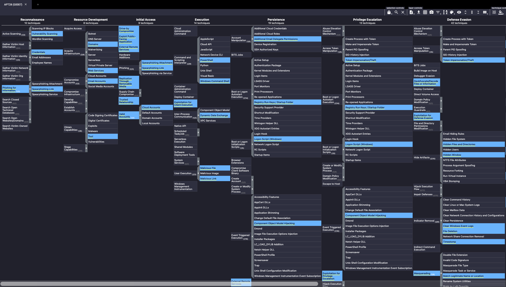
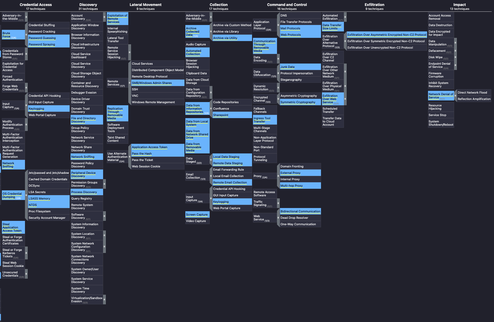

# APT Eviction Through MITRE ATT&CK Analysis

This lab simulates a **real-world SOC investigation** where a security analyst must identify, track, and evict an **Advanced Persistent Threat (APT)** attempting to steal intellectual property from an organization.

The investigation is driven by **threat intelligence** and mapped entirely to the **[MITRE ATT&CK framework](https://attack.mitre.org/)**, covering adversary behavior from reconnaissance through exfiltration.

---

## Scenario Overview

An organization operating in a high-value industry receives intelligence indicating that a known APT group is actively targeting similar entities. Based on this intelligence, the analyst must:

- Identify adversary **Tactics, Techniques, and Procedures (TTPs)**
- Validate whether the APT has already infiltrated the environment
- Detect and stop the adversary before data exfiltration occurs




---

## 1️⃣ Reconnaissance & Initial Access

### Identified Technique
```
Spearphishing Link
```

The adversary uses targeted phishing emails containing malicious links to gather intelligence and gain an initial foothold.

*MITRE ATT&CK:*  
- Reconnaissance  
- Initial Access

---

## 2️⃣ Resource Development – Account Compromise

### Identified Target
```
Email Accounts
```

Compromised email accounts allow the adversary to:
- Conduct internal phishing
- Gain trust
- Expand access within the organization

*MITRE ATT&CK:*  
- Resource Development

---

## 3️⃣ User Execution Techniques

### Identified Techniques
```
Malicious File
Malicious Link
```

Social engineering was used to convince users to execute attacker-controlled content.

*MITRE ATT&CK:*  
- Execution

---

## 4️⃣ Script-Based Execution

### Identified Interpreters
```
PowerShell
Windows Command Shell
```

These scripting environments were used to execute attacker commands post-compromise.

*MITRE ATT&CK:*  
- Execution

---

## 5️⃣ Persistence via Registry Modification

### Identified Persistence Mechanism
```
Registry Run Keys
```

Obfuscated scripts modified registry run keys to maintain persistence across system reboots.

*MITRE ATT&CK:*  
- Persistence

---

## 6️⃣ Defense Evasion via Signed Binary Proxy Execution

### Identified System Binary
```
rundll32.exe
```

The adversary abused legitimate Windows binaries to proxy malicious execution and evade security controls.

*MITRE ATT&CK:*  
- Defense Evasion  
- Signed Binary Proxy Execution

---

## 7️⃣ Network Discovery

### Identified Technique
```
Network Sniffing
```

The presence of packet capture utilities indicated reconnaissance of internal network traffic.

*MITRE ATT&CK:*  
- Discovery

---

## 8️⃣ Lateral Movement

### Identified Remote Services
```
SMB / Windows Administrative Shares
```

The adversary leveraged remote services to move laterally across systems.

*MITRE ATT&CK:*  
- Lateral Movement

---

## 9️⃣ Collection – Targeting Information Repositories

### Identified Target
```
SharePoint
```

Centralized document repositories were identified as the primary source of intellectual property theft.

*MITRE ATT&CK:*  
- Collection  
- Data from Information Repositories

---

## 🔟 Exfiltration Attempts & Proxy Usage

### Identified Proxy Techniques
```
External Proxy
Multi-Hop Proxy
```

Unable to connect directly to command-and-control infrastructure, the adversary attempted to route traffic through proxy chains to evade network controls.

*MITRE ATT&CK:*  
- Command and Control  
- Proxy

---

## Outcome: Successful Adversary Eviction

By identifying and disrupting adversary activity at multiple stages of the attack lifecycle, the organization successfully:

- Prevented data exfiltration
- Removed persistence mechanisms
- Blocked lateral movement
- Forced the adversary to abandon the operation

---

## Key Takeaways

- Intelligence-driven defense enables early detection
- MITRE ATT&CK provides clarity across the entire attack chain
- Eviction requires identifying **behavior**, not just indicators
- Effective defense disrupts attacker objectives, not just tools

---

## Frameworks Used

- MITRE ATT&CK
- Threat Intelligence–Driven Detection
- Behavioral & TTP-Based Analysis
